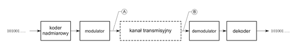

# Interactive Digital Modulation Explorer

This project, titled "Interactive Digital Modulation Explorer", is developed as part of a course requirement at West Pomeranian University of Technology (ZUT) by Vladimir Marianiuc. The project focuses on simulating various digital modulation techniques, visualizing their processes, and implementing error correction using Hamming codes through an interactive web application built with Dash.



## Objectives
The main objectives of this project are to:

1. Implement and demonstrate different digital modulation techniques, including Amplitude Shift Keying (ASK), Frequency Shift Keying (FSK), and Phase Shift Keying (PSK).
2. Visualize the modulation and demodulation processes for these techniques.
3. Simulate the addition of noise to the transmitted signal and analyze its effect on the demodulated signal.
4. Implement Hamming code for error detection and correction.
5. Provide an interactive interface for users to input parameters and observe the changes in real-time.
6. Educate users on the principles and equations behind each modulation technique and error correction through detailed explanations and visual aids.

## Features
1. Modulation Techniques:

   - ASK Modulation: Simulates the modulation and demodulation process using Amplitude Shift Keying.
   FSK Modulation: Implements the Frequency Shift Keying modulation and demodulation.
   PSK Modulation: Demonstrates the Phase Shift Keying modulation and demodulation.
   Noise Simulation:

   - Various types of noise (e.g., White Noise, Gaussian Noise) can be added to the transmitted signal to observe its effect on the demodulated signal.
2. Error Correction:

   - Hamming Code: Implements Hamming (7,4) code for error detection and correction, improving the reliability of data transmission.
3. Interactive Interface:

   - Users can input parameters such as carrier frequency, sampling rate, and noise levels.
   - Real-time visualization of modulated signals, transmitted signals with noise, and demodulated signals.
   - Display of original and corrected bit streams.
4. Error Analysis:

   - Calculation and display of the Bit Error Rate (BER) to evaluate the performance of each modulation technique under different noise conditions.
   - Display of syndrome and corrected bits for Hamming code.

## Technologies Used
- Dash: For building the interactive web application.
- Plotly: For creating dynamic and interactive graphs.
- NumPy: For numerical computations and signal processing.
- Python: The primary programming language for implementing the modulation, demodulation, and error correction algorithms.

## Getting Started

1. Clone the repository:
```bash
git clone https://github.com/marianciuc/Interactive-Digital-Modulation-Explorer.git
cd interactive-digital-modulation-explorer
```
2. Install dependencies:
```bash
pip install -r requirements.txt
```
3. Run the application:
```bash
python app.py
```
4. Open your browser and go to `http://127.0.0.1:8050` to start exploring!


## Project Structure

```bash
project_root/
│
├── callbacks.py            # Callback functions for interactivity
├── layout.py               # Layout of the Dash application
├── components/
│   ├── graphs.py           # Functions for creating graphs
│   ├── inputs.py           # Input components for the app
│   └── tabs.py             # Tab components for the app
├── assets/
│   └── img.png
├── modulation/
│   ├── __init__.py         # Initialization of the modulation package
│   ├── ask.py              # ASK modulation and demodulation functions
│   ├── fsk.py              # FSK modulation and demodulation functions
│   └── psk.py              # PSK modulation and demodulation functions
├── utilities/
│   ├── __init__.py         # Initialization of the utilities package
│   ├── hamming.py          # Hamming code functions for error correction
│   ├── utilities.py        # functions for bit error rate (BER) calculation and working with bit streams.
│   └── noise.py            # Noise generation functions
├── app.py                  # Main application file
└── requirements.txt        # Python package dependencies
```

## Conclusion
This project provides a comprehensive platform for learning and experimenting with different digital modulation techniques and error correction methods. It not only demonstrates the practical implementation of these techniques but also serves as an educational tool to understand the underlying principles and their impact on data transmission in the presence of noise.

For any inquiries or further information, please contact me at boosth14@gmail.com.

## License
This project is licensed under the MIT License - see the LICENSE file for details.
